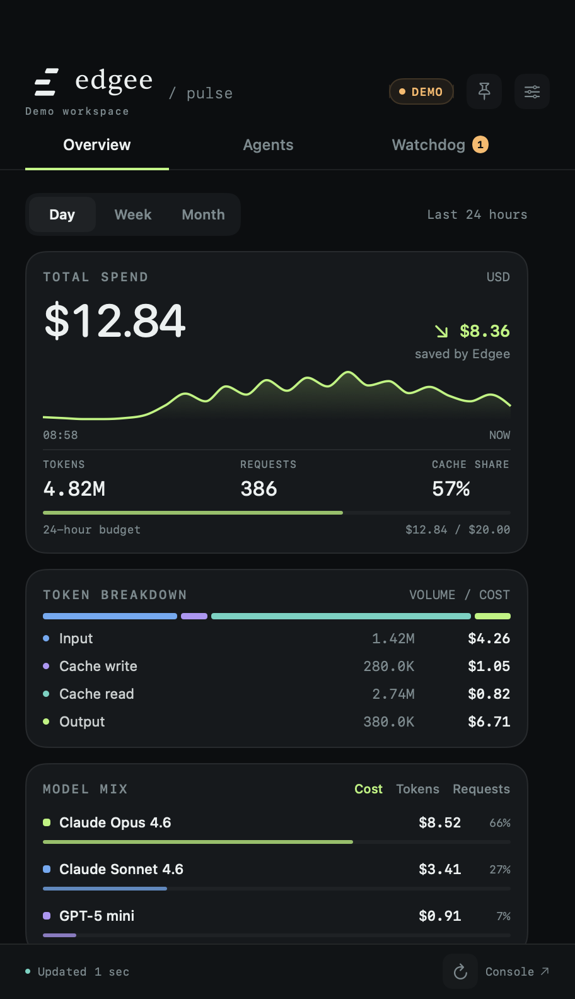

# Edgee Pulse

A native macOS menu bar companion for your Edgee agents. Your spend at a glance; the controls you reach for one click away.

Built with SwiftUI, AppKit, and Swift Charts. No Electron, web view, package dependencies, or analytics.



## Run

Requires **macOS 14+**, **Xcode 16+ / Swift 6+**, and the [Edgee CLI](https://www.edgee.ai/docs/features/cli).

```sh
make run
```

The app appears in your menu bar with your personal trailing 24-hour spend. Click it to open the panel. Right-click for refresh and quit. `⌘R` refreshes and Escape dismisses the popover. Pin it to keep it open.

To explore without an account:

```sh
make demo
```

Demo mode is visibly labeled, never makes API calls, and never changes your real agent settings. Exit demo to connect your account.

## What it does

- **Usage:** trailing 24 hours, 7 days, or 30 days; total spend and requests; input, cache-write, cache-read, and output token volumes and costs; spend history; model mix by cost, tokens, or requests.
- **Agents:** existing agent keys from your active CLI profile; tool compression, tool surface reduction, and output brevity; current route display and an on-demand model catalog preview. Model switching is marked “Soon available” and cannot submit route changes.
- **Watchdog:** spend/token budgets, frontier cost share, thinking-to-executor cost ratio, and session spend acceleration. Alerts link to agent controls. Nothing reroutes automatically.
- **Native behavior:** minute-by-minute refresh, optional macOS notifications, launch at login, a pin-to-open popover, and a menu bar cost that stays on the daily window while you browse week/month.

The API exposes **rolling windows**, not calendar dates. “Day” means the last 24 hours, including the menu bar and budget checks. Week means 7 days; Month means 30 days.

## Authentication

Use your existing Edgee CLI sign-in, or click **Connect with Edgee CLI** to start its browser login flow. The app reads the active profile and reuses its Console API token in memory. It does not maintain a second credential store or copy tokens to preferences.

Personal usage requests include the signed-in member ID, even for organization admins. Credentials are sent only to the official HTTPS Console API. API errors keep live failures visible; the app never substitutes demo or local CLI history for remote usage.

Switch accounts with `edgee auth switch`, then refresh. New agent keys are configured by launching an agent through Edgee; the widget discovers existing keys.

## Watchdog behavior

Default limits are $20 and 10 million tokens per trailing 24 hours, with budget warnings beginning at 80%. All values are editable in the Watchdog tab. A budget of zero disables that budget.

In **Watchdog → Model Roles**, the app suggests Thinking for Opus, GPT Sol, Kimi K3, GLM 5.3, and Deepseek v4.1; Executor for Sonnet, GPT Terra/Luna, the Qwen family, and Kimi 2.5. Suggestions recognize provider prefixes, versions, and common punctuation. These are workflow preferences, not capability ratings. **Apply suggested roles** accepts suggestions for models seen in the trailing 24 hours without overwriting manual roles. You can also choose a role individually or return it to Automatic.

Automatic classifications are estimates; thinking-to-executor advice requires accepted suggestions or manual assignments. Each model has one role, so assigning Thinking excludes it from Frontier share checks. All models still count toward budget limits. Session spike detection needs two fresh observations for the same session, ignores cost resets, and requires a meaningful increase before alerting.

Notifications are opt-in and limited to once per alert level per hour while the process runs. The app must remain running to monitor. These are advisory thresholds, not server-enforced spending caps.

## Develop and test

```sh
make test
make build
open Package.swift
```

CI runs on macOS 15 with Xcode 16.4 explicitly selected (Swift 6), runs tests, verifies the signed app and bundled branding, and uploads the packaged app.

Xcode can open the Swift package directly. `make build` creates the locally signed `build/Edgee.app`; `make run` builds and opens it. Copy that app to Applications if desired. For company deployment, `make package` builds a universal, Developer ID-signed and notarized installer using your configured signing identities. `make package-unsigned` creates review artifacts without signing credentials. See [company deployment](docs/DEPLOYMENT.md) for requirements, signing, and Jamf rollout.

```sh
scripts/run.sh --debug --demo --window
scripts/run.sh --debug --demo --window --agents
scripts/run.sh --debug --demo --window --watchdog
```

The app can render its actual native view for visual checks:

```sh
build/Edgee.app/Contents/MacOS/EdgeeWidget --demo --window \
  --snapshot "$PWD/build/overview.png" --exit-after-snapshot
```

For a restricted build environment that blocks SwiftPM’s nested sandbox:

```sh
EDGEE_SWIFT_DISABLE_SANDBOX=1 scripts/build-app.sh --debug
swift test --disable-sandbox --cache-path .build/cache \
  -Xswiftc -module-cache-path -Xswiftc .build/module-cache
```

## Structure

| Location | Responsibility |
| --- | --- |
| `Sources/EdgeeCore` | API/CLI integration, typed usage data, watchdog engine |
| `Sources/EdgeeWidget` | Native app lifecycle, state, notifications, SwiftUI interface |
| `Tests` | API conversion and watchdog regression checks |
| `scripts` | Build, package, sign, generate icon, launch |
| `docs/API.md` | Verified endpoint contracts and integration boundaries |

The app uses [Edgee’s official logo artwork](Resources/Branding/README.md), bundled as native vectors. Edgee retains ownership of its name and trademarks.

This project is licensed under the existing [GPL-3.0 license](LICENSE).
