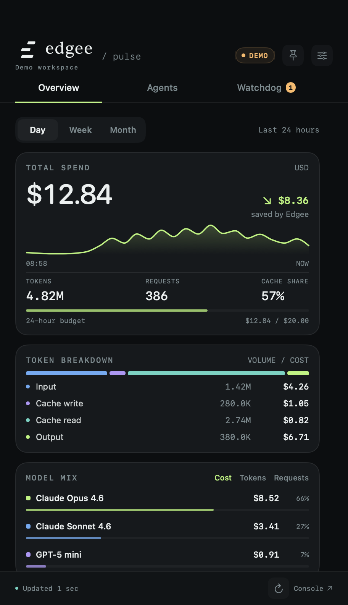

# Edgee Pulse

A native macOS menu bar companion for your Edgee agents. Your spend at a glance; the controls you reach for one click away.

Built with SwiftUI, AppKit, and Swift Charts. No Electron, web view, package dependencies, or analytics.



## Run

Requires **macOS 14+**, **Xcode 16+ / Swift 6+**, and the [Edgee CLI](https://www.edgee.ai/docs/features/cli).

```sh
make run
```

The app appears in your menu bar with your personal daily spend (trailing 24 hours by default). Click it to open the panel. Right-click for refresh and quit. `⌘R` refreshes and Escape dismisses the popover. Pin it to keep it open.

To explore without an account:

```sh
make demo
```

Demo mode is visibly labeled, never makes API calls, and never changes your real agent settings. Exit demo to connect your account.

## What it does

- **Usage:** rolling 24 hours, 7 days, or 30 days, or calendar day/week/month to date; total spend and requests; input, cache-write, cache-read, and output token volumes and costs; spend history; model mix by cost, tokens, or requests.
- **Agents:** existing agent keys from your active CLI profile; tool compression, tool surface reduction, and output brevity; current route display and an on-demand model catalog preview. Model switching is marked “Soon available” and cannot submit route changes.
- **Watchdog:** thinking-heavy token usage after noon, a $1,000 calendar-month spending threshold, and $50 actually spent in less than an hour. Native notifications open a model-routing preview. Thresholds and model families are editable in the Watchdog tab.
- **Native behavior:** minute-by-minute refresh, optional macOS notifications, launch at login, a pin-to-open popover, and a menu bar cost that stays on the daily window while you browse week/month.

Choose **Settings → Stats period**:

- **Rolling** (default): Day / Week / Month mean the last 24 hours / 7 days / 30 days.
- **Calendar**: Today / This week / This month use the Console API’s to-date presets, with UTC boundaries and Monday-start weeks.

The menu-bar cost and Overview daily budget follow the same mode. Watchdog uses independent calendar-day and calendar-month data (UTC). Switching modes refreshes immediately; the choice persists across launches. Calendar baselines reset at the next minute poll or wake after midnight.

## Authentication

Use your existing Edgee CLI sign-in, or click **Connect with Edgee CLI** to start its browser login flow. The app reads the active profile and reuses its Console API token in memory. It does not maintain a second credential store or copy tokens to preferences.

Personal usage requests include the signed-in member ID, even for organization admins. Credentials are sent only to the official HTTPS Console API. API errors keep live failures visible; the app never substitutes demo or local CLI history for remote usage.

Switch accounts with `edgee auth switch`, then refresh. New agent keys are configured by launching an agent through Edgee; the widget discovers existing keys.

## Watchdog behavior

The Watchdog tab has three independently enabled rules:

- **Thinking-heavy day:** after noon in the Mac's local timezone, warn when more than 50% of today's tokens belong to thinking families. Today's usage uses the Console's UTC day. All tokens, including unknown model families, remain in the denominator. Naming-based family suggestions can be overridden.
- **Monthly spending:** warn at $1,000 of member-scoped calendar-month spend (UTC).
- **Fast spending:** warn when cumulative spending increases by at least $50 in an observed interval shorter than one hour. This measures actual spending across multiple checks, not an extrapolated hourly rate. It needs two observations; history resets at a month boundary, account/scope change, or cost reset. Activity outside the observed interval cannot be reconstructed from hourly API buckets.

All amounts are USD, matching Edgee's API. The thresholds are editable and advisory; they do not enforce spending caps. Overview budgets and menu-bar behavior are unchanged. Saved manual family assignments are migrated to the new Watchdog preferences.

Notifications are opt-in through the macOS permission prompt. The tab shows system permission status, links to Notifications and Focus settings, and offers a test notification. Notifications include **Review model routing**, which opens the existing read-only model preview inside Watchdog. Model switching remains unavailable.

Daily/monthly warnings notify once per account and calendar window; fast-spending warnings notify at most once per hour. Successful notification history and recent spending observations persist across app restarts. Failed delivery is visible and retried on the next check. Checks run every minute while the app is running; data older than five minutes or from expired windows cannot generate alerts. Demo mode never requests usage or sends notifications.

**Focus / DND:** Time Sensitive delivery is opt-in and requires a signed, provisioned build with Apple's Time Sensitive Notifications capability. Users must also allow Time Sensitive notifications for Edgee and in their Focus settings. Ordinary local builds can be allowed through DND by adding Edgee to Focus's allowed apps. The app never overrides Focus settings or uses Critical Alerts. See [notification signing setup](docs/DEPLOYMENT.md#watchdog-notifications-and-focus).

## Develop and test

```sh
make test
make build
open Package.swift
```

CI runs on macOS 15 with Xcode 16.4 explicitly selected (Swift 6), runs tests, verifies the signed app and bundled branding, and uploads the packaged app.

The app and installer identifiers are configurable with `EDGEE_BUNDLE_ID` and `EDGEE_PACKAGE_ID`. Local builds use a reserved example identifier; signed distributions require explicitly chosen IDs in your own namespace. Signing keys remain in your Keychain. See [deployment configuration](docs/DEPLOYMENT.md) before building a production package.

Xcode can open the Swift package directly. `make build` creates the locally signed `build/Edgee.app`; `make run` builds and opens it. Copy that app to Applications if desired. For company deployment, `make package` builds a universal, Developer ID-signed and notarized installer using your configured signing identities. `make package-unsigned` creates review artifacts without signing credentials. See [company deployment](docs/DEPLOYMENT.md) for requirements, signing, and managed rollout.

```sh
scripts/run.sh --debug --demo --window
scripts/run.sh --debug --demo --window --agents
scripts/run.sh --debug --demo --window --watchdog
scripts/run.sh --debug --demo --window --calendar
```

The app can render its actual native view for visual checks:

```sh
build/Edgee.app/Contents/MacOS/EdgeeWidget --demo --window \
  --snapshot "$PWD/build/overview.png" --exit-after-snapshot
```

For a restricted build environment that blocks SwiftPM’s nested sandbox:

```sh
EDGEE_SWIFT_DISABLE_SANDBOX=1 scripts/build-app.sh --debug
swift test --disable-sandbox --cache-path .build/cache \
  -Xswiftc -module-cache-path -Xswiftc .build/module-cache
```

## Structure

| Location | Responsibility |
| --- | --- |
| `Sources/EdgeeCore` | API/CLI integration, typed usage data, watchdog engine |
| `Sources/EdgeeWidget` | Native app lifecycle, state, notifications, SwiftUI interface |
| `Tests` | API conversion and watchdog regression checks |
| `scripts` | Build, package, sign, generate icon, launch |
| `docs/API.md` | Verified endpoint contracts and integration boundaries |

The app uses [Edgee’s official logo artwork](Resources/Branding/README.md), bundled as native vectors. Edgee retains ownership of its name and trademarks.

This project is licensed under the existing [GPL-3.0 license](LICENSE).
